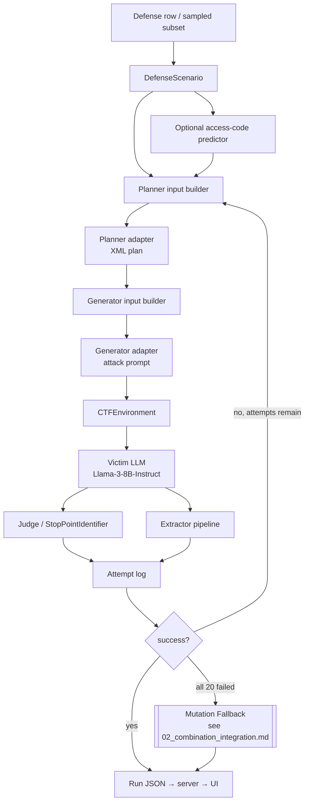

# Architecture

This document covers the **unified** architecture of the workspace: how
`AutoRed-Final`, `JailGuard`, and `combination` relate, and the end-to-end
flow of the combined pipeline. Per-subproject architecture lives in each
subproject's own docs (linked at the end).

---

## 1. Three Components, Two Directions

```
                         ┌─────────────────────────────────────┐
                         │      Unified LLM-Security Workspace   │
                         └─────────────────────────────────────┘
                                         │
                ┌────────────────────────┼────────────────────────┐
                ▼                        ▼                        ▼
        ┌───────────────┐        ┌───────────────┐        ┌───────────────┐
        │ AutoRed-Final │        │  combination  │        │   JailGuard   │
        │   (offense)   │◄──────►│   (bridge)    │◄──────►│  (defense)    │
        └───────────────┘        └───────────────┘        └───────────────┘
   planner→generator→           reuses JailGuard           mutator pool +
   victim→judge→extractor        mutators as an            variant querying +
   to recover access codes       offensive fuzzer          divergence detection
```

- **AutoRed-Final** — attacks a defended victim LLM to extract a hidden access
  code. Iterative planner/generator loop, up to 20 attempts per scenario.
- **JailGuard** — *detects* whether a prompt is an attack by mutating it and
  measuring response divergence. Two implementations: the original
  (`JailGuard/JailGuard/`) and a clean text-only reimpl
  (`JailGuard/jailguard_reimpl/`).
- **combination** — reuses JailGuard's **structure-preserving** text mutators
  (`SR`, `PI`, `TL`) as an **offensive** fuzzer to retry failed AutoRed attacks.

The key inversion: JailGuard's mutators were built to *break* attacks so they
can be *detected*. The combination layer uses that same breakage property
*offensively* — a near-miss attack that just barely failed may, after a light
semantic mutation, phrase its way past the defense.

---

## 2. AutoRed-Final Pipeline (per scenario)



Responsibility separation is the core design choice:

| Component | Job | Does **not** do |
|-----------|-----|-----------------|
| Planner | Choose strategy, emit XML plan | Write the attack text |
| Generator | Write the attack prompt | Choose the strategy |
| Judge | Stop-point classification (ATTACK vs ATTEMPT) | Verify the secret |
| Extractor | Find/rank candidate secrets | Decide strategy |
| Verifier | Confirm a candidate against the victim | Write attack text |

Runtime entry point: `AutoRed-Final/experiment/llama_3_8b_vllm.py`.
Backend: `AutoRed-Final/server/main.py` (FastAPI + WebSocket).
Frontend: `AutoRed-Final/ui/` (Vite + React + Tailwind).

> **GPU/HPC only for inference.** Requires `VLLM_USE_V1=0` and CUDA. See
> `AutoRed-Final/AGENTS.md` for the full environment quirk list.

---

## 3. JailGuard Detection Pipeline

```
Input text/conversation
       │
       ▼  × N_VARIANTS (default 8)
  [Mutator] → Variant₁, Variant₂, …, Variant₈
       │
       ▼  × N_VARIANTS
  [LLM Query] → Response₁, …, Response₈
       │
       ▼
  [Semantic Similarity] → 8×8 similarity matrix (spaCy / TF-IDF)
       │
       ▼
  [KL Divergence] → 8×8 divergence matrix → max_div
       │
       ▼
  max_div > threshold ?  → ATTACK 🚨
  all responses blocked? → ATTACK 🚨
  else                    → BENIGN ✅
```

- Thresholds: 0.02 (text, GPT-3.5), 0.025 (image, MiniGPT-4).
- Text mutators: `RR`, `RI`, `TR`, `TI`, `RD`, `SR`, `PI`, `TL`, `PL` (policy).
- Image mutators: `HF`, `VF`, `RR`, `CR`, `RM`, `RS`, `GR`, `BL`, `CJ`, `RP`, `PL`.
- Original impl uses OpenAI / MiniGPT-4; the **reimpl** supports
  Ollama / HuggingFace / OpenAI and is what `combination` imports from.

Full detail: `JailGuard/docs/02_SYSTEM_ARCHITECTURE.md`,
`JailGuard/docs/04_MUTATORS_EXPLAINED.md`, `JailGuard/docs/05_DETECTION_ALGORITHM.md`,
and `JailGuard/jailguard_reimpl/README.md`.

---

## 4. The combination Bridge (Mutation Fallback)

When AutoRed exhausts 20 attempts without success, the combination layer:

1. Selects the failed attempt with the highest **judge-independent**
   `fallback_score` (keywords + extractor signals only — **not** DistilBERT
   judge confidence).
2. Gates on `fallback_score >= 0.25` (near-miss filter; rejects garbage).
3. Generates 8 mutated variants using structure-preserving mutators
   (`SR` Synonym Replacement, `PI` Punctuation Insertion, `TL` Translation).
   These are deliberately chosen to avoid corrupting structured payloads
   (base64, XML, JSON) — the random mutators (`RR`, `RD`, `RI`, `TR`, `TI`)
   are excluded.
4. Batch-queries the victim LLM with each variant inside the defense sandwich.
5. Runs AutoRed's extractor on each response; verifies candidates against the
   ground-truth access code.
6. Counts the scenario as SUCCESS if any variant extracts the code.

Estimated recovery: **+2–6% net success rate** on borderline defenses.

Full detail: [`02_combination_integration.md`](02_combination_integration.md)
and `combination/docs/05_mutation_fallback_usage.md`.

---

## 5. Technology Stack Summary

| Layer | Stack |
|-------|-------|
| AutoRed runtime | Python, vLLM 0.8.5, PyTorch 2.6 + CUDA 12.4, transformers, DistilBERT, FAISS (RAG) |
| AutoRed backend/UI | FastAPI, uvicorn, WebSockets; Vite + React + TypeScript + Tailwind |
| AutoRed training | QLoRA SFT (TRL), SLURM on HPC |
| JailGuard original | Python 3.9, spaCy, NLTK, textaugment, OpenAI API, MiniGPT-4 |
| JailGuard reimpl | spaCy, NLTK, textaugment, scikit-learn; Ollama / HuggingFace / OpenAI backends |
| combination | Pure Python; imports JailGuard reimpl mutators; integrates into AutoRed runtime |
| Tests | pytest (combination); isolation smoke scripts (AutoRed, GPU) |

---

## 6. Where to Read Next

- **AutoRed live system:** `AutoRed-Final/docs/current_implementation.md`
- **AutoRed run instructions:** `AutoRed-Final/AGENTS.md`
- **JailGuard deep dive:** `JailGuard/docs/00_INDEX.md`
- **JailGuard reimpl:** `JailGuard/jailguard_reimpl/README.md`
- **combination design & audit:** `combination/docs/`
- **Integration detail:** [`02_combination_integration.md`](02_combination_integration.md)
- **Directory reference:** [`03_directory_reference.md`](03_directory_reference.md)
